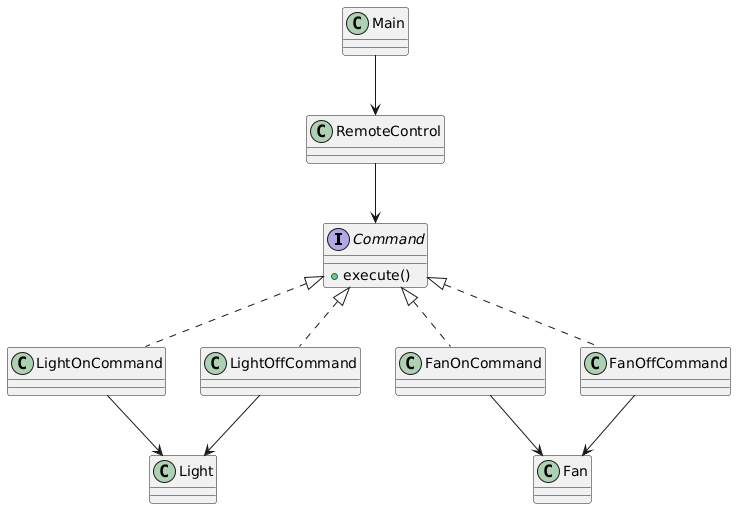

# Command Design Pattern – Remote Control System Package

## Overview
This package demonstrates the **Command Design Pattern** using a real-world scenario: a **Remote Control System**.

The Command Pattern is used to **encapsulate requests as objects**, allowing decoupling of the sender (remote) from the receiver (devices like Light and Fan) and supporting flexible execution of actions.

---

## Design Pattern: Command

- **Type:** Behavioral
- **Intent:** Encapsulate a request as an object, thereby allowing parameterization of clients with queues, requests, and operations.
- **When to Use:**
    - To decouple sender and receiver of a request.
    - To implement undo/redo functionality.
    - To support logging, queuing, or transactional behavior.
    - When you want to parameterize objects with operations.

---

## How This Package Works

1. **Command interface (`Command`)** defines the `execute()` method.
2. **Concrete Commands** (`LightOnCommand`, `LightOffCommand`, `FanOnCommand`, `FanOffCommand`) implement `Command` and execute requests on receivers.
3. **Receivers (`Light`, `Fan`)** perform the actual operations.
4. **Invoker (`RemoteControl`)** stores a command and executes it upon button press.
5. **Client (`Main.java`)** configures commands for the remote and triggers them.

---

## UML Class Diagram



---

## Example Usage

```java
RemoteControl remote = new RemoteControl();
Light livingRoomLight = new Light();

remote.setCommand(new LightOnCommand(livingRoomLight));
remote.pressButton();
```
**Output:**
````yaml
Light is ON
````

# Benefits of the Command Pattern
- Decouples sender and receiver.
- Supports undo/redo and queuing of requests.
- Encapsulates requests for flexible execution.
- Makes code maintainable and extensible.
- Provides a professional structure for executing operations in a controlled way.