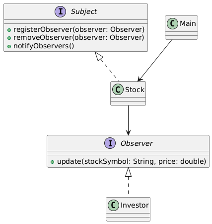

# Observer Design Pattern – Stock Price Alert System Package

## Overview
This package demonstrates the **Observer Design Pattern** using a real-world scenario: a **Stock Price Alert System**.

The Observer Pattern is used to **notify multiple observers automatically** whenever the state of a subject changes, without tightly coupling the subject and observers.

---

## Design Pattern: Observer

- **Type:** Behavioral
- **Intent:** Define a one-to-many dependency between objects so that when one object changes state, all its dependents are notified and updated automatically.
- **When to Use:**
    - When multiple objects need to be notified of state changes.
    - To achieve loose coupling between subject and observers.
    - When implementing event-driven or reactive systems.

---

## How This Package Works

1. **Observer interface (`Observer`)** defines the method `update(String stockSymbol, double price)`.
2. **Concrete Observer (`Investor`)** implements the `Observer` interface and reacts to stock price changes.
3. **Subject interface (`Subject`)** defines methods to register, remove, and notify observers.
4. **Concrete Subject (`Stock`)** maintains the state (stock price) and notifies observers when it changes.
5. **Client (`Main.java`)** registers investors and updates stock prices, triggering notifications.

---

## UML Class Diagram



---

## Example Usage

```java
Stock appleStock = new Stock("AAPL", 150.0);

Investor investor1 = new Investor("Alice");
Investor investor2 = new Investor("Bob");

appleStock.registerObserver(investor1);
appleStock.registerObserver(investor2);

appleStock.setPrice(155.0);
```
**Output:**
```yaml
Investor Alice notified: AAPL price changed to $155.0
Investor Bob notified: AAPL price changed to $155.0
```
# Benefits of the Observer Pattern
- Supports automatic updates of dependent objects.
- Promotes loose coupling between subject and observers.
- Supports event-driven and reactive programming.
- Makes the system flexible and maintainable.
- Easy to add or remove observers without changing the subject.