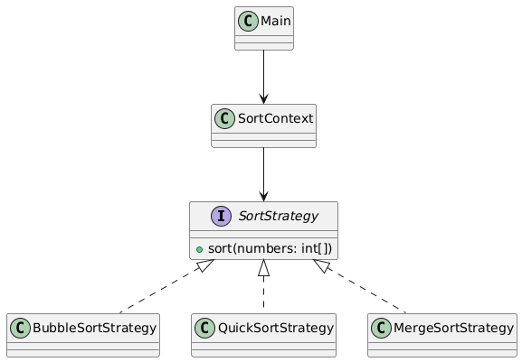

# Strategy Design Pattern – Sorting Algorithm Selector Package

## Overview
This package demonstrates the **Strategy Design Pattern** using a real-world scenario: a **Sorting Algorithm Selector** that can choose between multiple sorting algorithms at runtime.

The Strategy Pattern is used to **decouple the algorithm selection from the client**, allowing flexible switching of behavior without modifying existing code.

---

## Design Pattern: Strategy

- **Type:** Behavioral
- **Intent:** Define a family of algorithms, encapsulate each one, and make them interchangeable.
- **When to Use:**
    - When multiple algorithms exist for a task and clients need to choose at runtime.
    - To avoid conditional statements for selecting behavior.
    - To adhere to the Open/Closed Principle by adding new algorithms without changing existing code.

---

## How This Package Works

1. **Strategy Interface (`SortStrategy`)** defines the `sort(int[] numbers)` method.
2. **Concrete Strategies** implement different sorting algorithms:
    - `BubbleSortStrategy`
    - `QuickSortStrategy`
    - `MergeSortStrategy`
3. **Context (`SortContext`)** maintains a reference to a `SortStrategy` and delegates sorting to it.
4. **Client (`Main.java`)** sets the desired strategy dynamically and performs sorting.

---

## UML Class Diagram



---

## Example Usage

```java
SortContext context = new SortContext();
context.setStrategy(new BubbleSortStrategy());
context.sortArray(new int[]{5,2,8,3,1});
```

**Output:**
````yaml
Array sorted using Bubble Sort
  [1, 2, 3, 5, 8]
  Array sorted using Quick Sort
  [1, 2, 3, 5, 8]
  Array sorted using Merge Sort
  [1, 2, 3, 5, 8]
````
# Benefits of the Strategy Pattern
- Allows runtime selection of algorithms.
- Reduces conditional logic in client code.
- Supports Open/Closed Principle: new algorithms can be added without modifying existing code.
- Promotes clean separation of concerns.
- Makes code flexible, maintainable, and reusable.