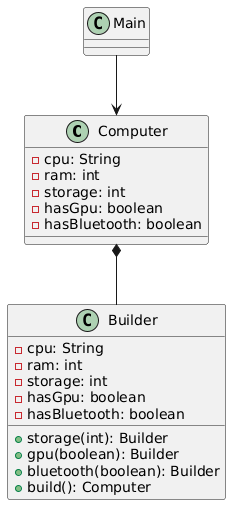

# Builder Design Pattern – Product Configuration Package

## Overview

This package demonstrates the **Builder Design Pattern** using a real-world scenario: **configuring a Computer with mandatory and optional components**.

The Builder Pattern is used to **construct complex objects step by step**, providing a clean and readable way to create different configurations without using multiple constructors.

---

## Design Pattern: Builder

* **Type:** Creational
* **Intent:** Separate the construction of a complex object from its representation, allowing the same construction process to create different configurations.
* **When to Use:**

    * When an object has many optional parameters.
    * When constructors become complex or hard to read.
    * To create immutable objects.
    * To provide a fluent and readable object creation process.
    * To avoid telescoping constructors.

---

## How This Package Works

1. **Product (`Computer`):** Represents the complex object being built, containing all configuration attributes.
2. **Builder (`Computer.Builder`):** Responsible for step-by-step construction of the `Computer` object.
3. **Mandatory parameters:** CPU and RAM are required during builder creation.
4. **Optional parameters:** Storage, GPU, and Bluetooth can be added using fluent methods.
5. **Client code (`Main.java`):** Uses the builder to create different computer configurations without dealing with object construction details.

---

## UML Class Diagram



---

## Example Usage

```java
Computer computer = new Computer.Builder("Intel i9", 32)
        .storage(2000)
        .gpu(true)
        .bluetooth(true)
        .build();
```

**Output:**

```yaml
Computer {cpu='Intel i9', ram=32GB, storage=2000GB, gpu=true, bluetooth=true}
```

---

## Benefits of the Builder Pattern

* Improves readability and maintainability of object creation.
* Eliminates complex constructors with many parameters.
* Supports immutable object design.
* Makes object creation flexible and scalable.
* Provides a fluent API that is easy to understand and use.
* Aligns with SOLID principles, especially Single Responsibility Principle.
