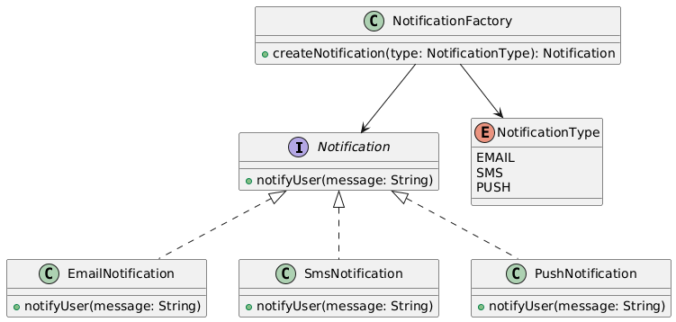

# Factory Design Pattern – Notification Service Package

## Overview
This package demonstrates the **Factory Design Pattern** using a real-world scenario: a **Notification Service** capable of sending messages through multiple channels (Email, SMS, Push Notification).

The Factory Pattern is used to **decouple object creation from the client code**, allowing easy extension when new notification types are added.

---

## Design Pattern: Factory

- **Type:** Creational
- **Intent:** Provide an interface for creating objects while allowing subclasses or factories to decide which concrete class to instantiate.
- **When to Use:**
    - When a class cannot anticipate which class of objects it must create.
    - To centralize object creation logic.
    - To enforce consistency in object creation.
    - To adhere to the Open/Closed Principle by allowing new types without changing existing client code.

---

## How This Package Works

1. **Notification interface:** Defines the method `notifyUser(String message)` for sending notifications.
2. **Concrete classes:** `EmailNotification`, `SmsNotification`, `PushNotification` implement the interface and provide their specific notification behavior.
3. **Factory class:** `NotificationFactory` creates the correct `Notification` instance based on the provided `NotificationType`.
4. **Client code (`Main.java`):** Requests a notification from the factory and uses it without knowing the underlying class implementation.

---

## UML Class Diagram 



## Example Usage

```java
Notification notification = NotificationFactory.createNotification(NotificationType.EMAIL);
notification.notifyUser("Congratulations! Your transaction was successful.");
```

**Output:**
``` yaml
EMAIL notification: Congratulations! Your transaction was successful.
```

## Benefits of the Factory Pattern

- Decouples object creation from usage, increasing maintainability.
- Makes the codebase scalable: new notification types can be added easily.
- Centralizes object creation logic in a single location.
- Follows SOLID principles, especially Open/Closed Principle.
- Provides a clear structure for extending functionality in a clean and professional way.
