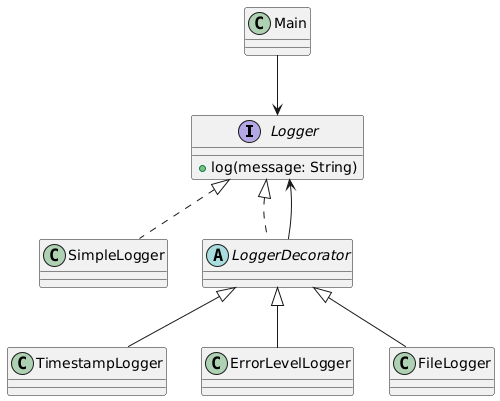

# Decorator Design Pattern – Customizable Logging Package

## Overview
This package demonstrates the **Decorator Design Pattern** using a real-world scenario: **Customizable Logging** that can dynamically add responsibilities such as timestamps, error levels, and file tagging to a basic logger.

The Decorator Pattern is used to **extend object behavior without modifying the original classes**, allowing flexible composition of features at runtime.

---

## Design Pattern: Decorator

- **Type:** Structural
- **Intent:** Attach additional responsibilities to an object dynamically without modifying its code.
- **When to Use:**
    - When behavior must be added at runtime.
    - To avoid subclass explosion for every combination of features.
    - To adhere to the Open/Closed Principle by extending functionality without modifying existing classes.
    - When you want flexible, reusable, and composable object behavior.

---

## How This Package Works

1. **Logger interface:** Defines the method `log(String message)` for logging.
2. **Concrete class (`SimpleLogger`):** Provides the basic logging functionality.
3. **Abstract Decorator (`LoggerDecorator`):** Wraps a `Logger` and delegates the call to it.
4. **Concrete decorators:** `TimestampLogger`, `ErrorLevelLogger`, `FileLogger` extend `LoggerDecorator` and add their specific logging behavior.
5. **Client code (`Main.java`):** Composes decorators dynamically and logs messages without knowing the underlying implementation details.

---

## UML Class Diagram



---

## Example Usage

```java
Logger logger = new TimestampLogger(
        new ErrorLevelLogger(
                new FileLogger(new SimpleLogger())
        )
);
logger.log("System failure detected");
```
**Output:**
````yaml
[File] [ERROR] [2025-12-27T12:34:56] System failure detected
````

# Benefits of the Decorator Pattern
- Adds behavior dynamically without modifying existing classes.
- Avoids subclass explosion for every combination of features.
- Supports flexible and reusable object composition.
- Promotes the Open/Closed Principle.
- Encourages composition over inheritance.
- Provides a professional, clean structure for extending functionality.