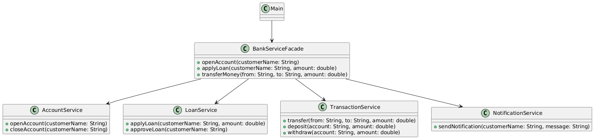

# Facade Design Pattern – Simplified Bank API Package

## Overview
This package demonstrates the **Facade Design Pattern** using a real-world scenario: a **Simplified Bank API** that provides a single interface to manage accounts, loans, transactions, and notifications.

The Facade Pattern is used to **simplify interactions with complex subsystems**, allowing clients to perform operations without dealing with all the details of each subsystem.

---

## Design Pattern: Facade

- **Type:** Structural
- **Intent:** Provide a unified interface to a set of interfaces in a subsystem, making it easier to use.
- **When to Use:**
    - When you want to simplify a complex subsystem for clients.
    - To decouple clients from subsystem classes.
    - To improve code readability and maintainability.
    - To adhere to the Open/Closed Principle by avoiding changes to subsystems when client requirements evolve.

---

## How This Package Works

1. **Subsystems:**
    - `AccountService` manages account operations.
    - `LoanService` manages loan applications and approvals.
    - `TransactionService` handles transfers, deposits, and withdrawals.
    - `NotificationService` sends messages to clients.
2. **Facade (`BankServiceFacade`):** Provides a simplified interface that combines subsystem operations.
3. **Client (`Main.java`):** Uses the facade to interact with the bank system without knowing the underlying subsystems.

---

## UML Class Diagram



---

## Example Usage

```java
BankServiceFacade bankFacade = new BankServiceFacade();

bankFacade.openAccount("Alice");
bankFacade.applyLoan("Alice", 5000);
bankFacade.transferMoney("Alice", "Bob", 1000);
```

**Output:**
````yaml
Account opened for Alice
Notification to Alice: Your account has been opened.
Loan of $5000.0 applied for Alice
Loan approved for Alice
Notification to Alice: Your loan has been approved.
Transferred $1000.0 from Alice to Bob
````

# Benefits of the Facade Pattern
- Simplifies interactions with complex subsystems.
- Reduces coupling between clients and subsystem classes.
- Improves readability and maintainability.
- Provides a clear and professional interface for clients.
- Supports the Open/Closed Principle by keeping subsystems unchanged.